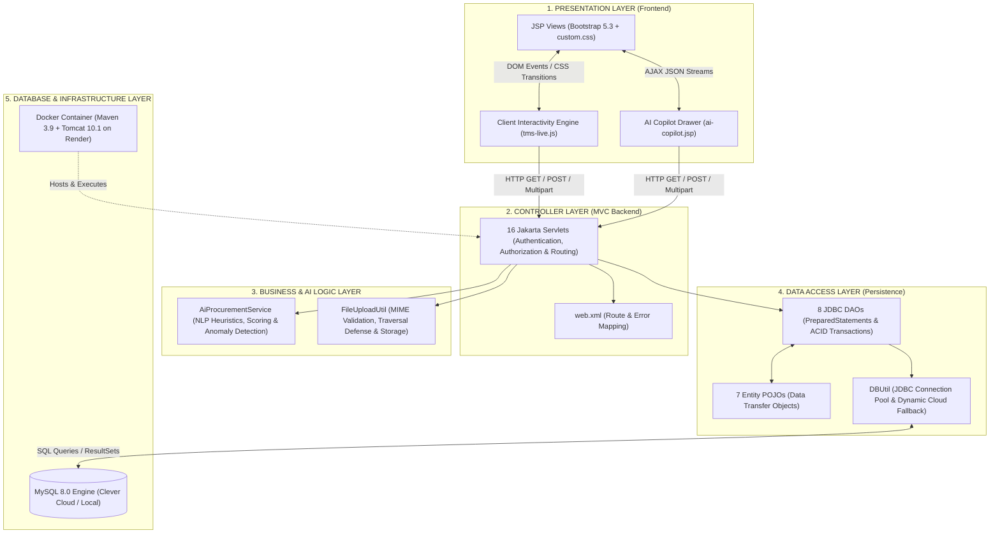

# Tender Management System (TMS) — Architectural Chart & File Segregation Guide

---

## 🏛️ 1. The Architectural Stack Diagram

---

## 📊 2. Master File Segregation Chart

### Layer 1: Presentation / Frontend Layer (`src/main/webapp/`)

| File / Component | Architectural Role | What It Does (Simple Explanation) |
| :--- | :--- | :--- |
| **`css/custom.css`** | Global Design System | Styles the glassmorphic navbar, typography, micro-elevations, animations, and PDF print rules. |
| **`js/tms-live.js`** | Client Interactivity Engine | Drives live countdown clocks, instant table filtering, count-up metric tickers, and toast popups. |
| **`login.jsp`** | Authentication View | Renders the sign-in form with 1-click **Admin Demo** and **Vendor Demo** filler buttons. |
| **`signup.jsp`** | Onboarding View | 2-column contractor registration portal with real-time password matching feedback. |
| **`index.jsp`** | Root Session Router | Inspects active session and safely routes users to `/dashboard`, `/tenders`, or `/login.jsp`. |
| **`navbar.jsp`** | Shared Navigation Component | Header with role-aware menus, brand shield emblem, and live in-app notification bell. |
| **`ai-copilot.jsp`** | Global Assistant Drawer | Floating offcanvas drawer providing contextual page walkthroughs and conversational Q&A. |
| **`dashboard.jsp`** | Executive Admin View | Displays 6 animated KPI cards, recent solicitations table with instant filter, and copy chips. |
| **`tenders.jsp`** | Catalog View | Searchable tender directory with Quick Sector pills (`Solar`, `Infra`, `IT`) and countdown timers. |
| **`tender-detail.jsp`** | Specification View | Displays RFP requirements, scope downloads, copy chips, and AI executive summary card. |
| **`tender-form.jsp`** | Procurement Authoring View | Form for admins to create and edit tenders with PDF/DOCX specification file uploads. |
| **`bid-form.jsp`** | Commercial Quotation View | Vendor bid submission with live word counter, **AI Auto-Draft**, and **AI Quality Meter**. |
| **`bid-comparison.jsp`**| Evaluation Board View | Ranks quotes from lowest (L1), featuring the **AI Bid Anomaly & Outlier Risk Detector**. |
| **`my-bids.jsp`** | Vendor Portfolio View | Displays submitted bids, proposal preview modals, and direct links to award certificates. |
| **`vendor-approvals.jsp`**| Compliance Verification View| Admin queue to verify contractor registrations and approve/reject them with 1 click. |
| **`award-certificate.jsp`**| Legal Procurement Document | Official formal certificate with dual signatures, security watermark, and 1-click PDF print. |
| **`notifications.jsp`** | User Alert Stream | Displays chronological notifications with unread badges and "Mark all as read" button. |
| **`audit-logs.jsp`** | Regulatory Audit View | Displays chronological, immutable compliance history of all system activities. |
| **`access-denied.jsp`** | Security Exception View | Branded **HTTP 403 Forbidden** page shown when a vendor tries accessing admin areas. |
| **`error-404.jsp`** | Routing Exception View | Branded **HTTP 404 Not Found** page for non-existent URLs. |
| **`error-500.jsp`** | Server Exception View | Branded **HTTP 500 Server Error** page for unexpected backend exceptions. |

---

### Layer 2: Controller & Routing Layer (`src/main/java/com/tms/servlet/`)

| File / Component | Technical Role | What It Does (Simple Explanation) |
| :--- | :--- | :--- |
| **`LoginServlet.java`** | Session Controller | Verifies credentials, generates user session attributes, and routes to appropriate landing page. |
| **`LogoutServlet.java`** | Session Terminator | Destroys session tokens and redirects user back to `login.jsp`. |
| **`RegisterServlet.java`**| Transactional Registration| Validates inputs, checks password match, and creates user + pending vendor profiles. |
| **`DashboardServlet.java`**| Admin Controller | Fetches high-level procurement metrics and blocks non-admin users with HTTP 403. |
| **`TenderListServlet.java`**| Directory Controller | Processes catalog search queries, category filters, and tender status checks. |
| **`TenderDetailServlet.java`**| Detail Controller | Loads tender specifications and checks if the active vendor has already submitted a bid. |
| **`TenderFormServlet.java`**| Form Handler | Processes admin tender publishing, updates, and handles specification file uploads. |
| **`BidServlet.java`** | Submission Controller | Enforces vendor approval, blocks duplicate bids, validates amount, and saves proposal PDF. |
| **`BidComparisonServlet.java`**| Contract Award Controller| Handles L1 comparison and executes atomic contract awards across multiple tables. |
| **`MyBidsServlet.java`** | Portfolio Controller | Loads vendor-specific bids and portfolio summary KPIs. |
| **`VendorApprovalServlet.java`**| Verification Controller | Lets administrators approve or reject pending contractor applications. |
| **`FileDownloadServlet.java`**| Secure File Streamer | Streams tender attachments with directory traversal guards and competitor blocking. |
| **`AwardCertificateServlet.java`**| Certificate Controller | Validates contract award and serves printable certificate only to Admin and winner. |
| **`NotificationServlet.java`**| Notification Controller | Serves notification list and delivers JSON streams (`?format=json`) for live navbar polling. |
| **`AuditLogServlet.java`**| Audit Controller | Serves paginated compliance history to administrators. |
| **`AiAssistantServlet.java`**| AI JSON REST Endpoint | Handles asynchronous AJAX calls for page tours, chat questions, and proposal scoring. |

---

### Layer 3: Business & Domain Intelligence Layer (`src/main/java/com/tms/service/`)

| File / Component | Technical Role | What It Does (Simple Explanation) |
| :--- | :--- | :--- |
| **`AiProcurementService.java`**| Local Embedded AI Engine | Executes rule-based NLP algorithms for proposal scoring, risk checks, and page familiarization without external APIs. |
| **`FileUploadUtil.java`** | Secure File Handler | Enforces file extensions (PDF/DOCX), generates unique UUID filenames, and prevents path traversal attacks. |

---

### Layer 4: Data Access & Entity Layer (`src/main/java/com/tms/dao/` & `model/`)

| File / Component | Technical Role | What It Does (Simple Explanation) |
| :--- | :--- | :--- |
| **`TenderDao.java`** | SQL Persistence Handler | Executes SQL for tenders (creating, editing, status changes, multi-filter searching). |
| **`BidDao.java`** | SQL Persistence Handler | Executes SQL for bids, prevents duplicate bids (`hasVendorBid`), and fetches quotes. |
| **`ContractAwardDao.java`**| Transactional Coordinator | Runs atomic SQL transactions (awards winning bid, rejects losing bids, closes tender). |
| **`VendorDao.java`** | SQL Persistence Handler | Handles vendor lookups, approval updates, and CIN uniqueness checks. |
| **`UserDao.java`** | SQL Persistence Handler | Manages user credentials, authentication lookups, and account queries. |
| **`DashboardDao.java`** | Analytics Aggregator | Executes optimized aggregate SQL queries (`COUNT`, `SUM`) to feed dashboard KPI cards. |
| **`NotificationDao.java`** | Alert Persistence Handler| Creates system alerts, tracks unread counts, and updates read states. |
| **`AuditLogDao.java`** | Immutable Event Logger | Writes tamper-proof audit trails for every critical administrative action. |
| **`DBUtil.java`** | Connection Pool Manager | Provides JDBC connections, reading cloud environment variables (`DB_URL`, `DB_USER`, `DB_PASSWORD`). |
| **`Model Classes (*.java)`**| Data Transfer Objects (POJOs)| `Tender`, `Bid`, `User`, `Vendor`, etc., holding data in typed variables with getters and setters. |

---

### Layer 5: Database Layer (`database/`)

| File / Component | Technical Role | What It Does (Simple Explanation) |
| :--- | :--- | :--- |
| **`schema.sql`** | Database DDL Blueprint | Creates the 7 relational tables with primary keys, foreign keys, indexes, and constraints. |
| **`seed.sql`** | Initial Data DML Script | Populates initial demo accounts (`admin@tms.com`, `vendor1@tms.com`), vendors, and sample tenders. |

---

### Layer 6: Build & Cloud Deployment Layer (Root Folder)

| File / Component | Technical Role | What It Does (Simple Explanation) |
| :--- | :--- | :--- |
| **`pom.xml`** | Maven Build Descriptor | Defines project dependencies (`jakarta.servlet-api`, `jstl`, `mysql-connector-j`) and packages the `.war`. |
| **`Dockerfile`** | Multi-Stage Container Recipe | Builds the WAR with Maven in Stage 1, and deploys it to Tomcat 10.1 in Stage 2 as `ROOT.war`. |
| **`.dockerignore`** | Build Optimization | Excludes temporary logs, local classes, and test files from being uploaded to Docker. |
| **`render.yaml`** | Infrastructure Blueprint | Tells Render.com to spin up a Docker container on port 8080 and connect the database. |
| **`start-tms.bat`** | Local Server Launcher | 1-click Windows shortcut to launch local Apache Tomcat 10.1 without terminal commands. |
| **`push-to-github.bat`**| Version Control Launcher | 1-click script to push any local code changes straight to your GitHub repository. |

---

## ⚡ 3. Summary of How the Stack is Segregated

1. **Frontend (`src/main/webapp`)**: Pure UI rendering (JSP), styles (`custom.css`), and browser interactivity (`tms-live.js`). **Zero business logic.**
2. **Backend (`src/main/java`)**: The brain. Servlets handle security and routing; DAOs talk safely to the database via `PreparedStatement`; AI services run scoring algorithms. **Zero HTML generation.**
3. **Database (`database/`)**: Relational storage engine (MySQL). Tables, foreign keys, and permanent records.
4. **Deployment (Root)**: Docker and Maven packaging enabling the system to run on **any** computer or cloud host with zero manual setup.
