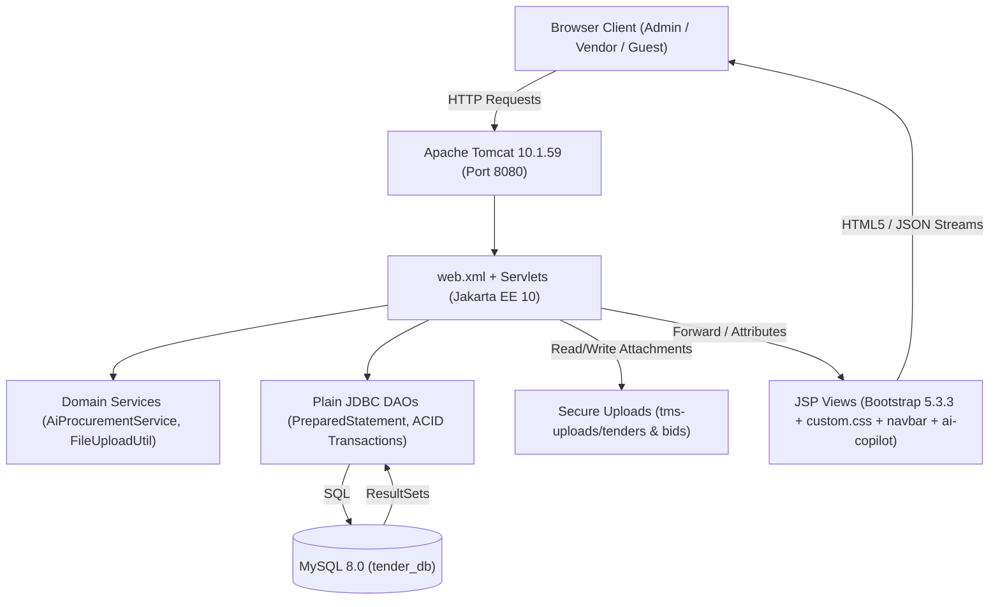

# Tender Management System (TMS)

A modern, full-lifecycle Enterprise Tender Management & Procurement Platform built with **Java 17**, **Jakarta EE 10 Servlets**, **JSP with JSTL 3.0**, **JDBC**, and **MySQL 8.0**, deployed on **Apache Tomcat 10.1.59**.

Designed with **strict framework-free architecture** (no Spring, no Hibernate/ORM), **three-file separation** (`DAO` $\rightarrow$ `Servlet` $\rightarrow$ `JSP`), **ACID database transactions**, **defense-in-depth role-based access control (RBAC)**, and **embedded modern AI tools** for page familiarization, proposal drafting, RFP summarization, and bid risk analytics.

---

## 🚀 Key Highlights & Standout Features

### 🤖 Modern AI Tools for Familiarization & Procurement Assistance
- **TMS AI Procurement Copilot (`ai-copilot.jsp`)**:
  - Global floating copilot (`✨ AI Copilot`) present on every page.
  - **Contextual Page Familiarization Tour**: Instantly explains what the active page does, user capabilities, actionable shortcuts, and compliance tips.
  - **Conversational Natural Language Q&A**: Answers user questions about L1 rules, deadlines, one-bid policies, certificates, and platform navigation.
- **AI Tender RFP Summarizer & Requirements Extractor (`/tender?id=X`)**:
  - Automatically synthesizes complex RFP descriptions into an executive summary, extracts 4–5 concrete deliverables, classifies procurement risk (`LOW`, `MEDIUM`, `HIGH`), and lists required vendor credentials.
- **AI Proposal Auto-Drafter & Live Strength Scorer (`/bid?tenderId=X`)**:
  - Generates bespoke, comprehensive commercial/technical proposals with one click.
  - Analyzes vendor proposal text in real time across 5 dimensions (Scope Depth, Quality/ISO Standards, Milestones & Timeline, Warranty/DLP, and Pricing Realism) with a dynamic **0–100% Strength Meter** and improvement tips.
- **AI Bid Anomaly & Outlier Risk Detector (`/bids?tenderId=X`)**:
  - Evaluates commercial quotes against engineering estimates, detects predatory pricing (> 30% below budget), flags budgetary overruns, and generates automated award justification notes.

### 📝 Vendor Registration & Enterprise Onboarding Portal (`/signup` / `signup.jsp`)
- **Modern Two-Column Layout**: Left column presents platform benefits (Certified Solicitations, Transparent L1 Evaluation, AI Proposal Assistant, Official Award Certificates) and verification protocol notes; right column houses a clean 2-section form.
- **Two-Section Form Flow**:
  1. *Authorized Representative*: Contact Name, Corporate Email, Password (with real-time interactive match indicators and min-length validation), Confirm Password.
  2. *Enterprise Profile*: Registered Legal Entity Name, Corporate Registration / CIN / GST, Official Phone, Business Address, Anti-collusion Code of Conduct compliance agreement.
- **Transactional Enrollment**: Atomically creates user credentials (`role=VENDOR`) and business entity (`status=PENDING`).
- **Interactive Guest AI Copilot**: Prospective contractors can open the floating AI Copilot directly from `/signup` to ask registration eligibility and RFP bidding questions.
- **Legacy Backward Compatibility**: `/register.jsp` and `/register` transparently forward to the new portal.

---

### 🛡️ Enterprise & Procurement Governance Features
- **Document & RFP File Attachments (`/download?type=tender|bid&id=X`)**:
  - Admins can upload official RFP documentation (`.pdf`, `.docx`, `.xlsx`, `.zip`) during tender publishing.
  - Vendors can attach technical schedules, blueprints, or cost breakdowns during bid lodgment.
  - Protected with UUID obfuscation, 10MB limits, canonical path verification, and strict competitor access barriers (HTTP 403).
- **Multi-Criteria Search, Filtering & Pagination (`/tenders`)**:
  - Keyword search, domain category dropdown, min/max budget bounds, and multi-column sorting.
  - Clean server-side pagination (6 tenders per page) preserving filter parameters.
- **Printable Legal Contract Award Certificate (`/award-certificate?tenderId=X`)**:
  - High-resolution legal certificate with security watermark, procurement reference, winning vendor registration, contract value in INR (`₹`), dual signature blocks, and `@media print` CSS for PDF export.
  - Strictly restricted to Administrators and the awarded Vendor.
- **In-App Real-Time Notifications & Audit Trail**:
  - Navbar bell dropdown with unread badge counter and automated AJAX polling.
  - Broadcast triggers for new tenders, vendor approvals/rejections, and contract awards.
  - Immutable compliance audit ledger at `/audit-logs` for statutory governance.

---

## 🏛️ System Architecture



### Architectural Principles
1. **Three-File Architecture**: Each feature adheres strictly to `DAO` $\rightarrow$ `Servlet` $\rightarrow$ `JSP`. Zero business logic in JSPs; zero HTML in Servlets.
2. **Framework-Free**: Pure Jakarta Servlets, JSTL 3.0, and JDBC with `PreparedStatement` (no Spring, Hibernate, or heavy ORMs).
3. **Defense-in-Depth**: Strict separation between `ADMIN` and `VENDOR` roles. Unauthorized requests receive custom HTTP 403 `access-denied.jsp` pages.
4. **Offline AI Execution**: All AI heuristics, NLP analysis, and evaluation algorithms run completely locally within the JVM with zero external API dependencies or costs.

---

## 📋 Role & Demonstration Accounts

| Role | Email | Password | Default Landing | Capabilities |
| :--- | :--- | :--- | :--- | :--- |
| **Administrator** | `admin@tms.com` | `admin123` | `/dashboard` | Executive dashboard, tender CRUD, vendor approvals, bid evaluation & contract awarding, audit logs, full attachment downloads |
| **Awarded Vendor (Menon Infra)** | `vendor1@tms.com` | `vendor123` | `/tenders` | View tenders, submit bids, track portfolio (`/my-bids`), view & print legal contract certificate for Tender #1 |
| **Competing Vendor (Apex Buildcon)** | `vendor2@tms.com` | `vendor123` | `/tenders` | Browse tenders, download specifications, submit bids, protected from competitor proposals |
| **Approved Vendor (Sharma Const.)** | `ananya@sharmaconstructions.com` | `vendorpass123` | `/tenders` | Approved vendor account |
| **Pending Vendor (Fraud Corp)** | `fraud@example.com` | `badpass123` | `/tenders` | Awaiting admin verification; blocked from submitting bids |

---

## 🛠️ Build, Deploy & Run Instructions (Windows)

### Prerequisites
- Java Development Kit (JDK 17 or higher)
- Apache Maven 3.9+
- Apache Tomcat 10.1.x (Standalone)
- MySQL Server 8.0+

### Step 1: Database Setup
Execute the initialization scripts in MySQL:
```sql
SOURCE database/schema.sql;
SOURCE database/seed.sql;
```

### Step 2: Configure Database Credentials
Verify credentials in `tms-maven/tms-maven/src/main/java/com/tms/util/DBUtil.java`:
- Host: `localhost:3306`
- Database: `tender_db`
- User: `root`

### Step 3: Build & Package
Run from `tms-maven/tms-maven`:
```powershell
mvn clean package
```

### Step 4: Deploy to Tomcat
Copy the generated WAR into Tomcat's `webapps` folder:
```powershell
Copy-Item "target\TenderManagementSystem.war" -Destination "C:\path\to\tomcat\webapps\TenderManagementSystem.war" -Force
```

### Step 5: Start Tomcat
Launch standalone Tomcat:
```powershell
cd "C:\path\to\tomcat\bin"
.\startup.bat
```

Open your browser to:
```
http://localhost:8080/TenderManagementSystem/
```

---

## ☁️ 24/7 Cloud Deployment Guide (Render.com / Railway.app)

The repository includes a production multi-stage [`Dockerfile`](file:///c:/Users/sreeh/OneDrive/Desktop/JAVA%20PROJECT%20SETUP/tms-maven/tms-maven/Dockerfile), [`.dockerignore`](file:///c:/Users/sreeh/OneDrive/Desktop/JAVA%20PROJECT%20SETUP/tms-maven/tms-maven/.dockerignore), and [`render.yaml`](file:///c:/Users/sreeh/OneDrive/Desktop/JAVA%20PROJECT%20SETUP/tms-maven/tms-maven/render.yaml) blueprint for permanent zero-cost hosting.

### Step 1: Push Code to GitHub
```bash
git init
git add .
git commit -m "feat: complete tender management system with AI and live UI"
git branch -M main
git remote add origin https://github.com/<your-username>/tender-management-system.git
git push -u origin main
```

### Step 2: Provision a Free Cloud MySQL Database
Create a free database on [Aiven.io](https://aiven.io/mysql), [Clever Cloud](https://www.clever-cloud.com/), or [Railway.app](https://railway.app/).
Run `database/schema.sql` and `database/seed.sql` on the cloud database.

### Step 3: Deploy on Render.com
1. Log in to [Render.com](https://render.com/).
2. Click **New +** $\rightarrow$ **Web Service**.
3. Connect your GitHub repository.
4. Select Environment: **Docker**.
5. Under **Environment Variables**, add:
   * `DB_URL`: `jdbc:mysql://<cloud-host>:<port>/<db_name>?useSSL=true&serverTimezone=UTC`
   * `DB_USER`: `<cloud_username>`
   * `DB_PASSWORD`: `<cloud_password>`
6. Click **Deploy Web Service**!
   Render will build the Docker container, run Tomcat 10.1, and give you a permanent live HTTPS link:
   `https://tender-management-system.onrender.com`


## ⚡ High-End Enterprise Frontend & Live Interactivity Engine

The user experience has been elevated with an enterprise-grade design system and zero-dependency client-side interactivity engine (`js/tms-live.js`):

- **Modern Enterprise Typography**: Styled with Google Fonts `Plus Jakarta Sans` (for crisp display headers, stats, and badges) paired with `Inter` (for refined data presentation and forms).
- **Glassmorphic Navigation Bar**: Translucent blurred backdrop (`backdrop-filter: blur(16px)`), subtle slate borders, brand shield emblem (`🛡️`), and animated top reading progress bar.
- **Dynamic KPI Metric Counters**: Smooth cubic-bezier count-up animations on page load for all executive dashboard and vendor portfolio summary metrics.
- **Real-Time Ticking Countdown Clocks**: Synchronized deadline tickers calculating remaining Days, Hours, Minutes, and Seconds every 1000ms with automatic urgency color pulses (`< 24h` remaining).
- **Instant Live Table Search**: Debounced, zero-latency client-side search across all table rows with dynamic match counter badges (`Found X of Y entries`) across tenders, bids, vendor approvals, and audit logs.
- **1-Click Clipboard Copy Chips**: Interactive badges for Tender IDs, Reference Numbers, CINs, GST codes, and RFP scope snippets with automatic floating toast confirmations.
- **Interactive Forms & Widgets**:
  - `login.jsp`: 1-click **Admin Demo** and **Vendor Demo** filler buttons for instant, frictionless evaluation.
  - `bid-form.jsp`: Live proposal word count, estimated reading time ticker, and submit button loading state.
  - `tenders.jsp`: Sector filter pills (`All`, `Solar & Renewable`, `Infrastructure`, `IT & Software`) with instant filter feedback.
  - Floating Toast Notifications (`TMS.toast`): Non-intrusive alert system replacing traditional alert modals.
  - Page Entrance Animations: Micro-elevations and seamless view fade transitions (`tmsPageFade`).

---

## 🧪 Verification Matrix

### Role-Based Access Control & Security Matrix (16 Tests)

| Category | Endpoint / Feature | Test Description | Status |
| :--- | :--- | :--- | :---: |
| **Security** | `/dashboard` | Vendor access blocked with HTTP 403 | **PASS** |
| **Security** | `/vendor-approvals` | Non-admin access blocked with HTTP 403 | **PASS** |
| **Security** | `/tender-form` | Non-admin access blocked with HTTP 403 | **PASS** |
| **Security** | `/audit-logs` | Non-admin access blocked with HTTP 403 | **PASS** |
| **Security** | `/download?type=bid&id=X` | Competitor proposal download blocked with HTTP 403 | **PASS** |
| **Security** | `/award-certificate?tenderId=X`| Competitor certificate access blocked with HTTP 403 | **PASS** |
| **Procurement**| `/award-certificate` | Admin and winning vendor render legal certificate | **PASS** |
| **Procurement**| `/download?type=tender` | Tender RFP specification document downloaded | **PASS** |
| **Procurement**| `/tenders?q=...` | Multi-filter search and pagination verified | **PASS** |
| **Procurement**| `/notifications` | Real-time JSON notification stream verified | **PASS** |
| **AI Copilot** | `/api/ai?action=page_guide` | Contextual page tour and capabilities delivered | **PASS** |
| **AI Copilot** | `/api/ai?action=chat` | Natural language Q&A answers procurement rules | **PASS** |
| **AI RFP** | `/api/ai?action=summarize_tender`| Executive synthesis, deliverables & risk extracted | **PASS** |
| **AI Bidding** | `/api/ai?action=draft_proposal` | Context-tailored technical proposal generated | **PASS** |
| **AI Award** | `/api/ai?action=evaluate_bids` | Outlier risk analysis & auto-justification notes | **PASS** |
| **AI Security**| `/api/ai?action=evaluate_bids` | Vendor forbidden from evaluation analytics (HTTP 403) | **PASS** |

### UI & Interaction Endpoints Matrix (15 Tests)

| Target View / Interaction | Route / Action | Expected Result | Status |
| :--- | :--- | :--- | :---: |
| **Public Login Portal** | `GET /login.jsp` | HTTP 200 (Shield header + 1-click Demo Fillers) | **PASS** |
| **Public Signup Portal** | `GET /signup` | HTTP 200 (2-column layout + Live validation) | **PASS** |
| **Admin Executive Dashboard** | `GET /dashboard` | HTTP 200 (KPI count-ups + Live search filter) | **PASS** |
| **Admin Tender Directory** | `GET /tenders` | HTTP 200 (Category pills + Live countdowns) | **PASS** |
| **Admin Tender Form** | `GET /tender-form` | HTTP 200 (RFP specification upload + validation) | **PASS** |
| **Admin Tender Detail #1** | `GET /tender?id=1` | HTTP 200 (Closed tender status + Copy chips) | **PASS** |
| **Admin Tender Detail #5** | `GET /tender?id=5` | HTTP 200 (Active countdown + AI Summary widget) | **PASS** |
| **Admin Bid Comparison #1** | `GET /bids?tenderId=1` | HTTP 200 (L1 analysis + Award certificate link) | **PASS** |
| **Admin Vendor Approvals** | `GET /vendor-approvals`| HTTP 200 (Instant table search + Copyable CINs) | **PASS** |
| **Admin Compliance Audit Logs** | `GET /audit-logs` | HTTP 200 (Live filter + Event trail pagination) | **PASS** |
| **Vendor Tender Directory** | `GET /tenders` | HTTP 200 (Bid submission buttons + Urgency badges)| **PASS** |
| **Vendor Tender Detail #5** | `GET /tender?id=5` | HTTP 200 (Live countdown ticker + Scope copy chip)| **PASS** |
| **Vendor Portfolio View** | `GET /my-bids` | HTTP 200 (Portfolio KPI tickers + Status badges)| **PASS** |
| **Vendor Bid Submission (Fresh)**| `GET /bid?tenderId=3` | HTTP 200 (AI proposal meter + Live word counter)| **PASS** |
| **Duplicate Bid Protection** | `GET /bid?tenderId=5` | HTTP 302 (Redirects to detail; prevents double bid)| **PASS** |

*All 31 automated security, procurement, AI, and UI interaction tests passed with 100% accuracy.*

